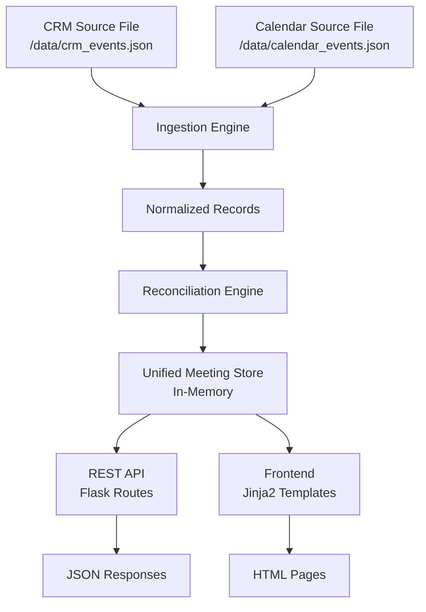
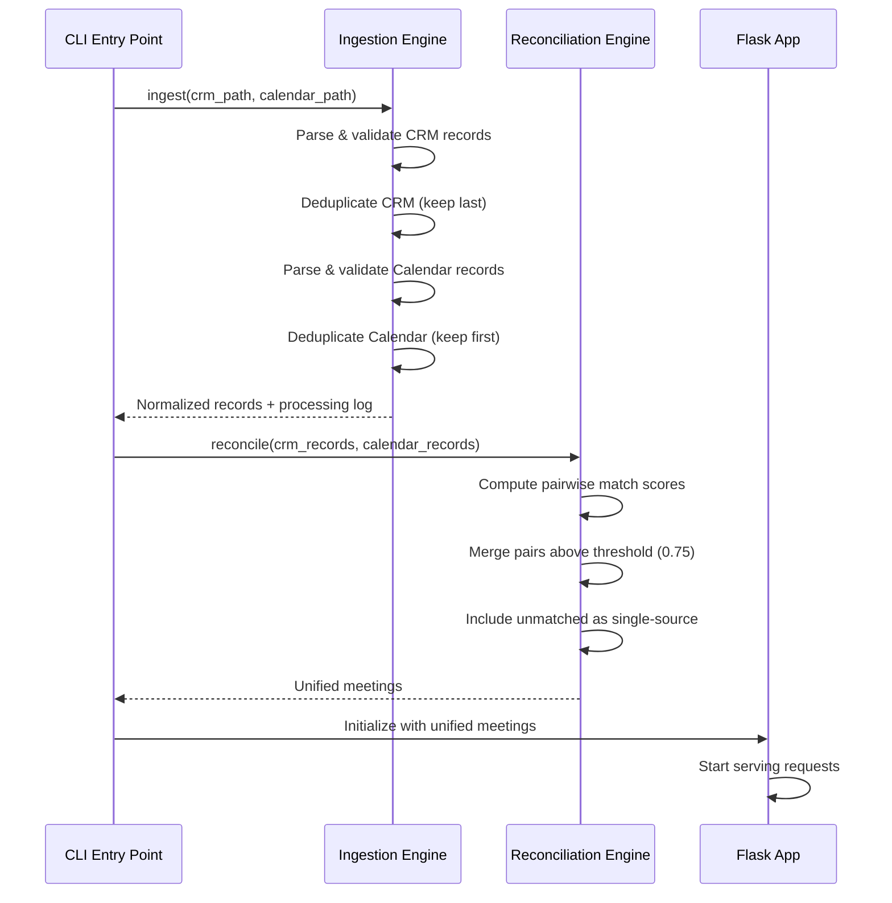

# Design Document: Event Sync Service

## Overview

The Event Sync Service is a Python/Flask application that ingests meeting records from two upstream JSON files (CRM and Calendar), reconciles them into unified meeting records using fuzzy matching heuristics, and serves the results through a REST API and web frontend.

The core technical challenge is record reconciliation without shared identifiers. The system uses a multi-signal matching approach combining temporal proximity, attendee overlap, and subject similarity to determine whether two records from different sources represent the same real-world meeting.

### Key Design Decisions

1. **Single-process architecture**: All components (ingestion, reconciliation, API, frontend) run in one Flask process. This simplifies startup and deployment while meeting the single-command requirement.
2. **In-memory data store**: Reconciled meetings are held in memory after startup ingestion. Given the scale (≤1000 records per source), persistence is unnecessary.
3. **Eager ingestion**: Data is ingested and reconciled at startup before the server accepts requests, guaranteeing consistent state from first request.
4. **Deterministic conflict resolution**: Field-level priority rules (CRM for client fields, Calendar for time/location) ensure reproducible results.

## Architecture



### Startup Sequence



## Components and Interfaces

### 1. Ingestion Engine (`ingestion.py`)

Responsible for reading, parsing, validating, deduplicating, and normalizing source records.

```python
class IngestionEngine:
    def ingest_crm(self, file_path: str) -> IngestionResult:
        """Parse CRM source file into normalized records.
        
        Deduplication: keeps LAST occurrence of duplicate IDs.
        Raises IngestionError on file-level failures.
        """
        ...

    def ingest_calendar(self, file_path: str) -> IngestionResult:
        """Parse Calendar source file into normalized records.
        
        Deduplication: keeps FIRST occurrence of duplicate IDs.
        Raises IngestionError on file-level failures.
        """
        ...

    def _validate_record(self, raw: dict, source: str) -> NormalizedRecord:
        """Validate and normalize a single raw record."""
        ...
```

**IngestionResult**:
```python
@dataclass
class IngestionResult:
    records: list[NormalizedRecord]
    warnings: list[ValidationWarning]
    dedup_log: list[DedupEntry]
    summary: ProcessingSummary
```

### 2. Reconciliation Engine (`reconciliation.py`)

Matches records across sources and merges them into unified meetings.

```python
class ReconciliationEngine:
    CONFIDENCE_THRESHOLD: float = 0.75
    DATE_PROXIMITY_WINDOW: timedelta = timedelta(minutes=30)
    ATTENDEE_OVERLAP_MIN: float = 0.50
    SUBJECT_SIMILARITY_MIN: float = 0.70

    def reconcile(
        self, crm_records: list[NormalizedRecord], 
        calendar_records: list[NormalizedRecord]
    ) -> list[UnifiedMeeting]:
        """Reconcile records from both sources into unified meetings."""
        ...

    def compute_match_confidence(
        self, record_a: NormalizedRecord, record_b: NormalizedRecord
    ) -> float:
        """Compute match confidence score between two records (0.0-1.0)."""
        ...

    def _date_proximity_score(self, dt_a: datetime, dt_b: datetime) -> float:
        """Score based on temporal distance. 1.0 if same time, 0.0 if ≥30min apart."""
        ...

    def _attendee_overlap_score(
        self, attendees_a: set[str], attendees_b: set[str]
    ) -> float:
        """Score based on Jaccard-like attendee overlap."""
        ...

    def _subject_similarity_score(self, subject_a: str, subject_b: str) -> float:
        """Score based on string similarity (SequenceMatcher ratio)."""
        ...

    def _merge_records(
        self, crm_record: NormalizedRecord, cal_record: NormalizedRecord,
        confidence: float
    ) -> UnifiedMeeting:
        """Merge two matched records, applying conflict resolution."""
        ...

    def _resolve_conflict(
        self, field_name: str, crm_value: Any, cal_value: Any
    ) -> ConflictResolution:
        """Apply deterministic source-priority conflict resolution."""
        ...
```

### 3. REST API (`api.py`)

Flask blueprint exposing reconciled data as JSON.

```python
# GET /api/meetings -> list of all unified meetings (200)
# GET /api/meetings/<id> -> single meeting by ID (200 or 404)
```

### 4. Frontend (`frontend.py` + templates)

Flask blueprint serving Jinja2-rendered HTML pages.

```python
# GET / -> meeting list page (sorted by date descending)
```

### 5. Application Entry Point (`app.py`)

Orchestrates startup: ingestion → reconciliation → Flask server.

```python
def create_app() -> Flask:
    """Create Flask app with ingested and reconciled data."""
    ...

if __name__ == "__main__":
    app = create_app()
    app.run()
```

## Data Models

### NormalizedRecord

The internal representation after ingestion, common to both sources:

```python
@dataclass
class NormalizedRecord:
    source_id: str              # Original record identifier from source
    source: str                 # "crm" or "calendar"
    title: str                  # Meeting title/subject
    start_time: datetime | None # Meeting start time (UTC)
    end_time: datetime | None   # Meeting end time (UTC)
    duration_minutes: int | None # Duration in minutes
    organizer: str | None       # Meeting organizer name/email
    attendees: list[str]        # List of attendee names/emails
    location: str | None        # Meeting location
    description: str | None     # Meeting description/notes
    raw_data: dict              # Original source record for reference
    is_valid: bool              # Whether all required fields passed validation
    validation_warnings: list[str]  # Descriptions of validation issues
```

### UnifiedMeeting

The reconciled output record:

```python
@dataclass
class UnifiedMeeting:
    id: str                     # Generated unique identifier (UUID)
    title: FieldValue           # Meeting title with provenance
    start_time: FieldValue      # Start time with provenance
    end_time: FieldValue        # End time with provenance
    organizer: FieldValue       # Organizer with provenance
    attendees: FieldValue       # Attendee list with provenance
    location: FieldValue        # Location with provenance
    description: FieldValue     # Description with provenance
    source_records: list[str]   # Source record IDs that contributed
    sources: list[str]          # ["crm"], ["calendar"], or ["crm", "calendar"]
    match_confidence: float | None  # None for single-source, 0.0-1.0 for merged
    conflicts: list[Conflict]   # Fields where sources disagree
```

### FieldValue

Tracks provenance per field:

```python
@dataclass
class FieldValue:
    value: Any                  # The primary (resolved) value
    source: str                 # Source that provided the primary value
    alternative: Any | None     # The non-primary value (if conflict exists)
    alternative_source: str | None  # Source of the alternative value
    is_conflict: bool           # Whether this field has conflicting values
```

### Conflict

Detailed conflict record:

```python
@dataclass
class Conflict:
    field_name: str             # Name of the conflicting field
    primary_value: Any          # The selected primary value
    primary_source: str         # Source that provided the primary value
    alternative_value: Any      # The non-selected value
    alternative_source: str     # Source that provided the alternative
    resolution_reason: str      # Why this resolution was chosen
```

### Conflict Resolution Priority Map

| Field | Priority Source | Rationale |
|-------|---------------|-----------|
| title | CRM | CRM titles reflect client-facing naming |
| organizer | CRM | CRM tracks the relationship owner |
| attendees | CRM | CRM has the authoritative client contact list |
| description | CRM | CRM notes capture client context |
| start_time | Calendar | Calendar is the system of record for scheduling |
| end_time | Calendar | Calendar is the system of record for scheduling |
| location | Calendar | Calendar manages room/location bookings |

### Match Confidence Scoring

The match confidence is computed as a weighted combination of three signals:

```
confidence = (0.4 × date_score) + (0.3 × attendee_score) + (0.3 × subject_score)
```

Where:
- **date_score**: Linear interpolation from 1.0 (identical times) to 0.0 (≥30 minutes apart)
- **attendee_score**: `|A ∩ B| / |A ∪ B|` (Jaccard similarity of attendee sets, case-insensitive)
- **subject_score**: `SequenceMatcher(title_a, title_b).ratio()` (Python stdlib difflib)

A pair is merged when `confidence ≥ 0.75`.

### Processing Log Models

```python
@dataclass
class ValidationWarning:
    source: str
    record_id: str
    field: str
    reason: str

@dataclass
class DedupEntry:
    source: str
    discarded_id: str
    kept_id: str
    reason: str

@dataclass
class ProcessingSummary:
    source: str
    total_parsed: int
    incomplete_count: int
    duplicates_removed: int
```


## Correctness Properties

*A property is a characteristic or behavior that should hold true across all valid executions of a system — essentially, a formal statement about what the system should do. Properties serve as the bridge between human-readable specifications and machine-verifiable correctness guarantees.*

### Property 1: Normalization Preserves Source Data

*For any* valid source record (CRM or Calendar) containing all required fields in correct format, normalizing that record SHALL produce a NormalizedRecord where every required field value matches the corresponding input value.

**Validates: Requirements 1.1, 2.1**

### Property 2: Validation Identifies All Field Issues

*For any* source record with one or more missing required fields or fields with invalid format, the Ingestion Engine SHALL mark the record as incomplete and produce validation warnings that identify each specific failing field.

**Validates: Requirements 1.2, 2.2**

### Property 3: CRM Deduplication Keeps Last Occurrence

*For any* list of CRM records where two or more records share the same source record identifier, after deduplication, the output SHALL contain exactly one record per unique ID and that record SHALL be the last-occurring instance in the input list.

**Validates: Requirements 1.3**

### Property 4: Calendar Deduplication Keeps First Occurrence

*For any* list of Calendar records where two or more records share the same source record identifier, after deduplication, the output SHALL contain exactly one record per unique ID and that record SHALL be the first-occurring instance in the input list.

**Validates: Requirements 2.3**

### Property 5: Processing Summary Accuracy

*For any* set of Calendar records processed by the Ingestion Engine, the processing summary counts (total parsed, incomplete count, duplicates removed) SHALL exactly match the actual counts of records parsed, records marked incomplete, and records discarded during deduplication.

**Validates: Requirements 2.4**

### Property 6: Match Confidence Bounds

*For any* pair of NormalizedRecords, the computed Match_Confidence SHALL be a value in the range [0.0, 1.0] inclusive.

**Validates: Requirements 3.4**

### Property 7: Record Completeness After Reconciliation

*For any* set of normalized CRM and Calendar records, after reconciliation, every input record SHALL appear in exactly one Unified_Meeting — either merged with its match (confidence ≥ 0.75) or included as a single-source entry.

**Validates: Requirements 3.2, 3.3**

### Property 8: Output Uniqueness Constraint

*For any* set of Unified_Meeting records produced by the Reconciliation Engine, no two Unified_Meeting records SHALL both have start times within 30 minutes of each other AND at least 50% attendee overlap.

**Validates: Requirements 3.6**

### Property 9: Conflict Resolution With Source Priority

*For any* pair of merged records where the CRM and Calendar sources provide different non-null values for the same field, the Unified_Meeting SHALL mark the field as a conflict, select the primary value from the priority source (CRM for title/organizer/attendees/description, Calendar for start_time/end_time/location), and preserve the non-priority source's value as the alternative with correct source labels.

**Validates: Requirements 4.1, 4.2, 4.3**

### Property 10: Null Fields Do Not Generate Conflicts

*For any* pair of merged records where one source provides a non-null value for a field and the other provides null or empty, the Unified_Meeting SHALL NOT mark that field as a conflict, and SHALL use the non-null value as the primary value.

**Validates: Requirements 4.4**

### Property 11: API Serialization Completeness

*For any* Unified_Meeting record, its JSON serialization via the REST API SHALL include provenance metadata (source labels) for every field and, for fields marked as conflicts, SHALL include both primary and alternative values with their source labels.

**Validates: Requirements 5.2, 5.3**

### Property 12: Meeting Display Sort Order

*For any* non-empty list of Unified_Meeting records displayed in the frontend, the records SHALL be ordered by meeting date/time in descending order (most recent first).

**Validates: Requirements 6.6**

## Error Handling

### File-Level Errors (Ingestion)

| Error Condition | Behavior | Exit Strategy |
|----------------|----------|---------------|
| Source file missing | Raise `IngestionError` with file path | Abort ingestion for that source |
| File not readable (permissions) | Raise `IngestionError` with OS error | Abort ingestion for that source |
| File is not valid JSON | Raise `IngestionError` with parse error | Abort ingestion for that source |
| File is valid JSON but wrong structure | Raise `IngestionError` with schema error | Abort ingestion for that source |

On file-level failure, no partial output is produced. The error propagates to the startup orchestrator.

### Record-Level Errors (Ingestion)

| Error Condition | Behavior |
|----------------|----------|
| Missing required field | Mark record incomplete, add warning, continue |
| Field wrong type/format | Mark record incomplete, add warning, continue |
| Unparseable date/time | Mark record incomplete, field set to None, add warning |
| Duplicate source ID | Apply dedup strategy (last for CRM, first for Calendar), log action |

Record-level errors never halt processing. Invalid records remain available for downstream use with their validation status.

### Reconciliation Errors

| Error Condition | Behavior |
|----------------|----------|
| Empty input from one source | Reconcile only the available source (all single-source meetings) |
| Empty input from both sources | Return empty meeting list |
| All records invalid | Include in output with single-source provenance; invalid records can still match |

### Startup Errors

| Error Condition | Behavior |
|----------------|----------|
| Any file-level ingestion failure | Log error, exit with non-zero code |
| Reconciliation fails unexpectedly | Log error, exit with non-zero code |
| Port already in use | Flask default behavior (error message) |

### API Errors

| Error Condition | Response |
|----------------|----------|
| Meeting ID not found | 404 with JSON error body |
| Unexpected server error | 500 with JSON error body |

## Testing Strategy

### Property-Based Tests (fast-check equivalent: Hypothesis for Python)

The project will use **Hypothesis** (Python property-based testing library) for property tests.

Each property test:
- Runs a minimum of **100 iterations** with randomly generated inputs
- References its design document property number
- Uses Hypothesis strategies to generate realistic meeting record data

**Tag format:** `# Feature: event-sync-service, Property {N}: {property_text}`

Property tests cover:
- Normalization round-trip (Property 1)
- Validation detection (Property 2)
- CRM dedup last-occurrence (Property 3)
- Calendar dedup first-occurrence (Property 4)
- Summary accuracy (Property 5)
- Confidence bounds (Property 6)
- Record completeness (Property 7)
- Output uniqueness (Property 8)
- Conflict resolution (Property 9)
- Null-not-conflict (Property 10)
- Serialization completeness (Property 11)
- Sort order (Property 12)

### Unit Tests (pytest)

Example-based tests for:
- File-level error handling (missing file, invalid JSON, wrong structure)
- API endpoint routing (200, 404 responses)
- Frontend rendering with sample data
- Empty state display
- Startup with missing data files (non-zero exit)
- Content-Type header verification

### Integration Tests

- Full startup → ingestion → reconciliation → API response flow
- Startup timing (< 30 seconds for 1000 records)
- Data available on first API request after startup

### Test Organization

```
tests/
├── test_ingestion_properties.py    # Property tests for ingestion (Properties 1-5)
├── test_reconciliation_properties.py # Property tests for reconciliation (Properties 6-10)
├── test_api_properties.py          # Property tests for API serialization (Property 11)
├── test_frontend_properties.py     # Property tests for display order (Property 12)
├── test_ingestion_unit.py          # Unit tests for error cases
├── test_api_unit.py                # Unit tests for endpoints
├── test_frontend_unit.py           # Unit tests for template rendering
└── test_integration.py             # End-to-end integration tests
```

### Test Dependencies

```
# test requirements
pytest>=7.0
hypothesis>=6.0
```

### Running Tests

```bash
pytest tests/ -v
```

Property tests are configured via Hypothesis settings:
```python
from hypothesis import settings, given

@settings(max_examples=100)
@given(...)
def test_property_name(...):
    ...
```
